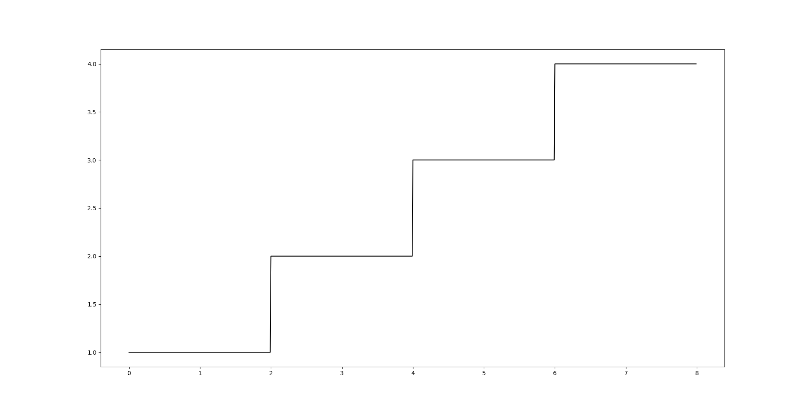
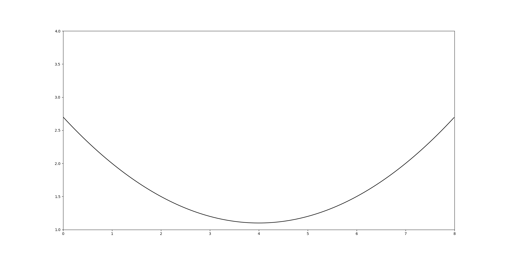
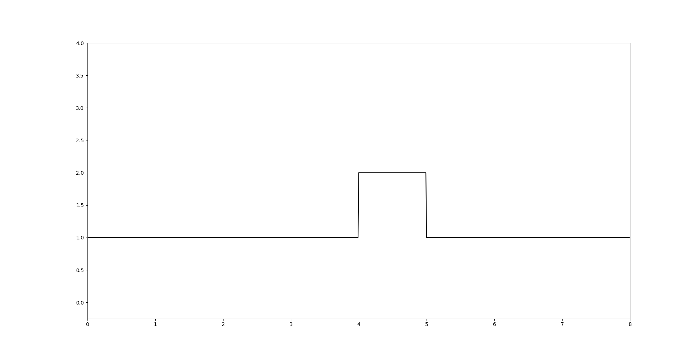
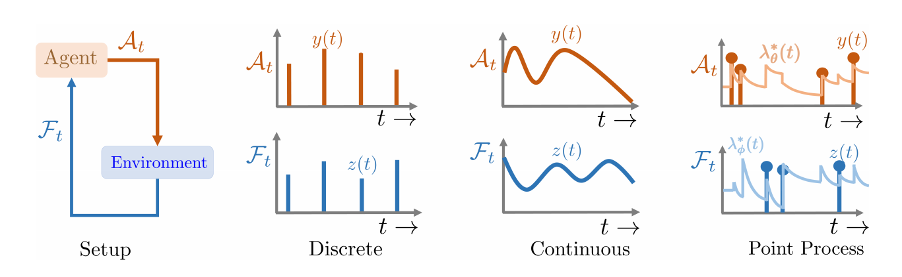

# Concept

## The problem with cron

A typical SaaS workflow looks like this:

> Every Monday at 09:00, our Mailchimp newsletter goes out. Every night at
> 03:00, we pull a Stripe report. Every quarter, we run a coupon campaign
> by creating a Stripe promotion code, attaching it to a Mailchimp campaign,
> and sending it to a list segment.

These schedules are static. They were chosen once, by a human, based on a
guess about when subscribers are most receptive, when payment data is "done"
for the day, when promotions land best. Once chosen, they do not adapt.

## What "the right time" actually depends on

For a recurring service call, the optimal firing time is a function of an
underlying information process that we cannot observe directly — we only see
events:

- A customer opens a previous email (event).
- A payment succeeds (event).
- A subscription renewal nears (event).
- A user logs in (event).

These events are arrivals from an unknown intensity function. The "right
moment" to send the next campaign / pull the next report / push the next
promo is the moment that maximises some reward over the unknown intensity
— typical example: maximise the probability that the recipient acts on the
message, weighted against not being annoying.

The intensity itself can take many shapes. Three illustrative examples
used across `experiments/`:

| Step                                          | Continuous                                          | Interrupt                                          |
| ---                                           | ---                                                 | ---                                                |
|                   |                   |                   |
| Discrete jumps in activity at fixed instants. | Smooth dip-and-rise across the window.              | Constant baseline with a short burst of activity.  |

## Marked Temporal Point Processes

A Marked Temporal Point Process (MTPP) models a sequence of events
`(t_1, k_1), (t_2, k_2), ...` where `t_i` are timestamps drawn from an
intensity `λ(t | history)` and `k_i` are marks (categories, payloads).

Reinforcement learning on an MTPP can learn a *policy* that decides when to
inject a "controlled" event into the stream — exactly the question we want
to answer for business services.

The leftmost panel is the standard RL setup: the agent emits actions
`A_t`, the environment returns observations `F_t`. The remaining three
panels are the variants of *what* an action looks like — discrete events,
a continuous signal, or a point process with intensities `λ*(t)`. Gombaz
sits in the rightmost panel: each "action" is one fired API call, and
each observation is whatever event stream comes back from the external
service.

The original setting in the paper we build on is **Spaced Repetition**:
when should a tutoring system show a student a flashcard, given that the
student forgets at an unknown rate? The learner picks review times.

The mapping to Gombaz is:

| Spaced Repetition          | Gombaz                                       |
| ---                        | ---                                          |
| Student                    | Customer base / external system              |
| Flashcard                  | One business service (e.g. promo campaign)   |
| Forgetting curve `n_i(t)`  | Underlying information process               |
| Review event               | API call / DAG run                           |
| Recall probability `m(t)`  | "Reward" of firing the call now              |
| Multiple items             | Reduced to a single item — see `learner/`    |

## Architecture sketch

See `images/workflow-bpmn.png` for the original BPMN diagram. The shape is:
event source → scheduler (this is where the learner sits) → orchestrator
(Airflow DAG) → external services (Stripe, Mailchimp, …) → outcome
observation → back into the event source.
