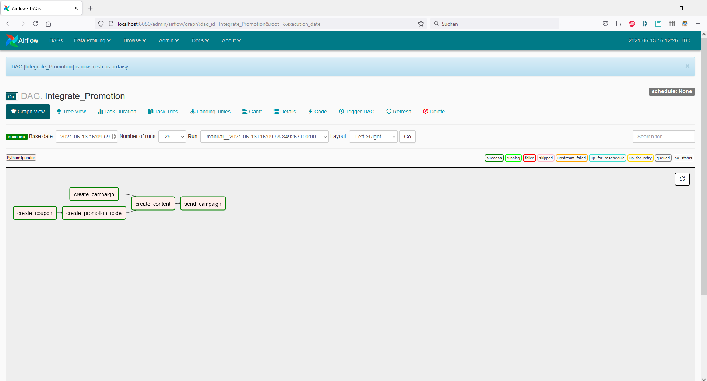
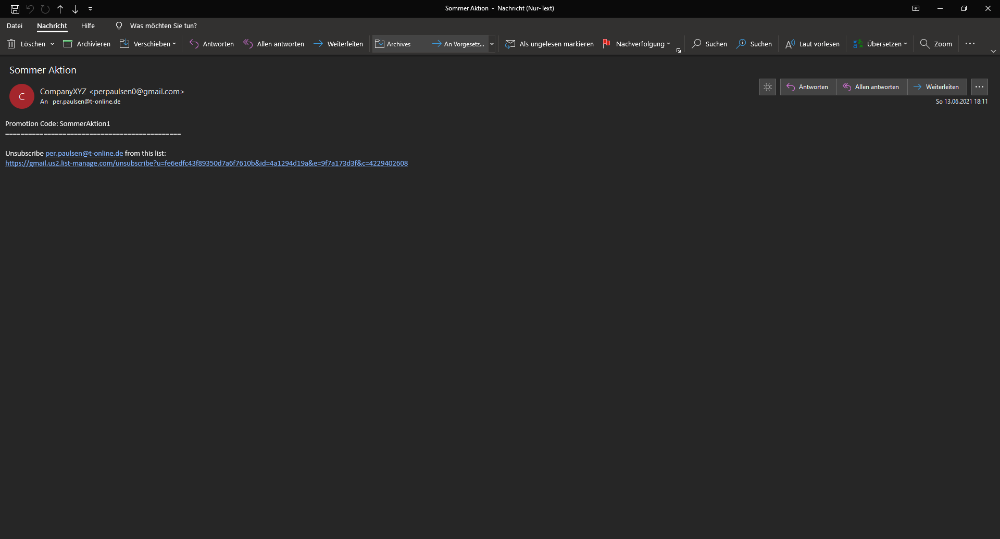
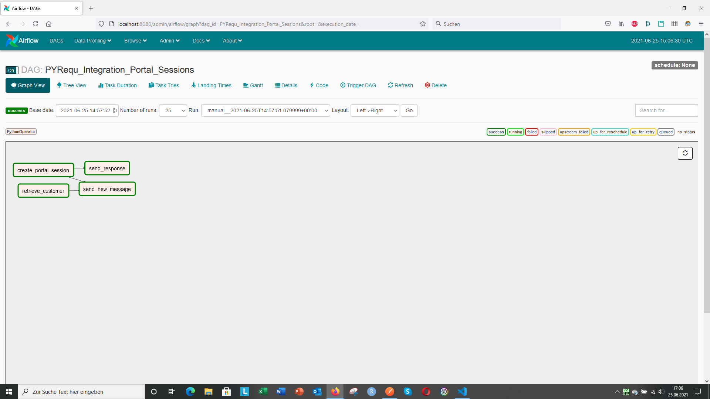
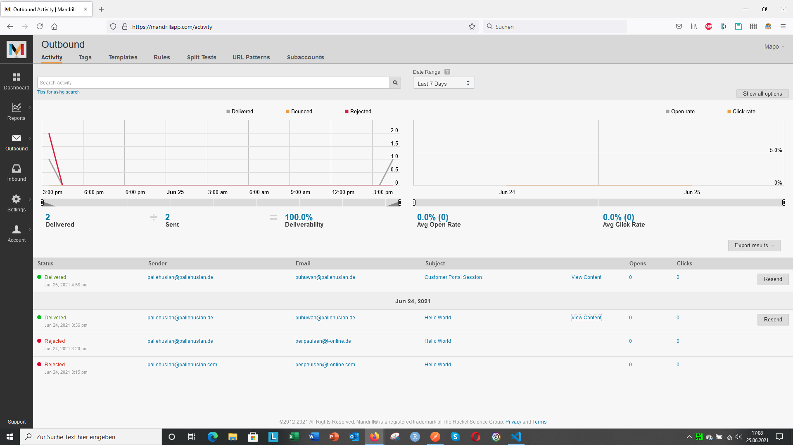

# DAGs

Three DAGs, picked to be self-contained illustrations.

## `stripe_mailchimp_promo.py`

Five tasks, two diamond-shaped data dependencies, two external services.
This is the kind of cross-service workflow Gombaz wants to schedule
intelligently.

End result of a successful run — the campaign mail with the injected
promotion code:

## `stripe_portal_session_mandrill.py`

Short, two-step. Creates a one-shot customer-portal session URL in Stripe
and sends it to the customer via Mandrill.

Resulting Mandrill mail with the portal link:

## `http_examples.py`

Trivial `SimpleHttpOperator` against local httpbin, useful as a smoke test
for the Airflow setup itself.

## Notes

All DAGs have `schedule_interval=None` and must be triggered manually.
Credentials come from environment variables (see `../.env.example`); the
DAG will fail-fast on import if something is missing.
